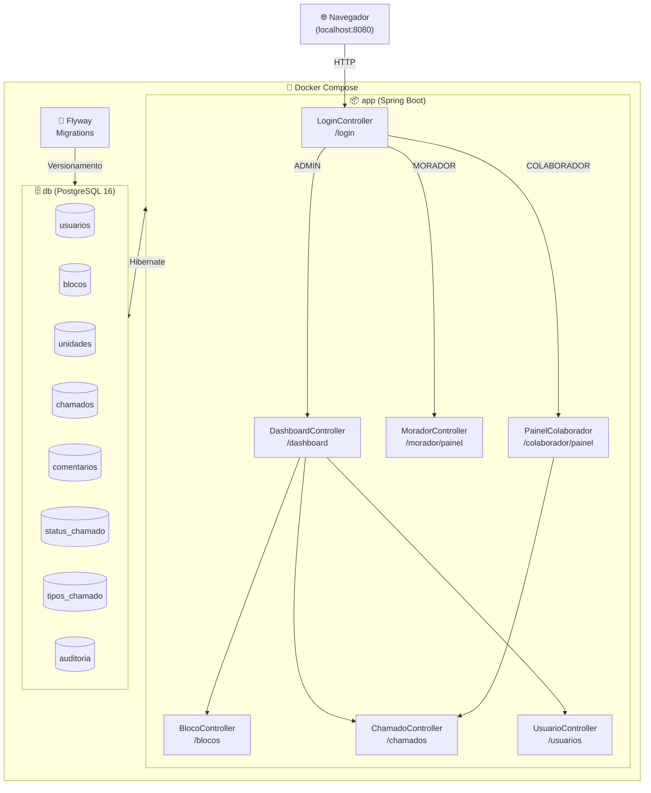

# 🏢 CondoDesk — Sistema de Gerenciamento de Chamados

> **Desafio Nº 0004/2026 — Dunnas Tecnologia**
> **Candidato:** Paulo Artur Aragão
> **Stack:** Java 21 · Spring Boot 3.2.4 · JSP · PostgreSQL · Flyway · Docker


---

## 📋 Visão Geral

O **CondoDesk** é uma solução completa para administração de condomínios. O sistema permite a gestão de chamados, organização de blocos e unidades, com controle de acesso baseado em perfis para **Administradores**, **Colaboradores** e **Moradores**.

---

## ✨ Diferenciais Implementados

| Recurso | Descrição |
|---|---|
| 🐳 **Docker Completo** | Sobe banco + aplicação com um único `docker compose up` |
| 🔄 **Flyway Migrations** | Banco versionado, tabelas criadas automaticamente no primeiro boot |
| 🔐 **Controle de Acesso** | Três níveis de permissão com regras de negócio aplicadas em controller e view |
| 🚀 **Redirecionamento Inteligente** | A raiz `/` identifica o perfil e redireciona automaticamente |
| 📝 **Auditoria de Ações** | Todas as ações relevantes são registradas com usuário, data e descrição |
| 💬 **Histórico de Comentários** | Moradores, colaboradores e admins interagem via comentários nos chamados |
| ⏱️ **SLA por Tipo de Chamado** | Cada tipo de chamado possui prazo máximo configurável pelo admin |

---

## 🗂️ Estrutura do Projeto

```
src/
├── main/
│   ├── java/com/example/testejsp/
│   │   ├── config/               # Interceptors e configuração Web
│   │   ├── model/                # Entidades JPA
│   │   ├── repository/           # Interfaces Spring Data JPA
│   │   ├── service/              # Lógica de negócio (AuditoriaService, BlocoService)
│   │   ├── ChamadoController.java
│   │   ├── BlocoController.java
│   │   ├── UsuarioController.java
│   │   ├── VinculoController.java
│   │   └── ...
│   ├── resources/
│   │   ├── db/migration/         # Migrations Flyway (V1 a V6)
│   │   └── application.properties
│   └── webapp/WEB-INF/jsp/       # Views JSP
└── test/                         # Testes unitários
```

---

## 🗺️ Diagrama de Arquitetura



---

## 🗃️ Diagrama Relacional do Banco

```
usuarios
├── id (PK)
├── nome
├── email (UNIQUE)
├── senha
└── tipo (ADMIN | COLABORADOR | MORADOR)

blocos
├── id (PK)
├── identificacao
├── quantidade_andares
└── apartamentos_por_andar

unidades
├── id (PK)
├── numero
├── andar
└── bloco_id (FK → blocos)

usuario_unidades  ← vínculo morador ↔ unidade
├── usuario_id (FK → usuarios)
└── unidade_id (FK → unidades)

tipos_chamado
├── id (PK)
├── titulo
└── sla_horas

status_chamado
├── id (PK)
└── nome

chamados
├── id (PK)
├── titulo
├── descricao
├── status
├── tipo_chamado (texto)
├── data_abertura
├── data_finalizacao
└── unidade_id (FK → unidades)

comentarios
├── id (PK)
├── texto
├── data_comentario
├── chamado_id (FK → chamados)
└── usuario_id (FK → usuarios)

auditoria
├── id (PK)
├── acao
├── entidade
├── descricao
├── data_hora
└── usuario_id (FK → usuarios)
```

---

## 🚀 Como Executar

### Pré-requisitos

- [Docker](https://www.docker.com/) e Docker Compose instalados (apenas isso!)

### ▶️ Subir com Docker (recomendado)

```bash
# 1. Clone o repositório
git clone <url-do-repositorio>
cd condodesk

# 2. Suba tudo com um único comando
docker compose up --build

# 3. Aguarde a mensagem nos logs:
#    Started CondoDeskApplication in X seconds
```

Acesse: **http://localhost:8080**

> O Flyway roda as migrations automaticamente. O banco é criado do zero na primeira execução.

---

### 🔧 Executar sem Docker (alternativa)

**Pré-requisitos:** Java 21, Maven, PostgreSQL rodando localmente.

```bash
# Configure o banco em src/main/resources/application.properties
# Ajuste: spring.datasource.url, username e password

# Execute
./mvnw spring-boot:run
```

---

## 🔑 Credenciais Iniciais

As contas abaixo são criadas automaticamente pelo seed do Flyway (`V3__insert_admin.sql`):

| Perfil | E-mail | Senha | Acesso |
|---|---|---|---|
| **Admin** | `admin@admin.com` | `123456` | Dashboard completo, gestão de blocos, usuários, tipos e status |
| **Morador** | `morador@teste.com` | `123456` | Painel do morador, abertura e acompanhamento de chamados |
| **Colaborador** | `colaborador@teste.com` | `123456` | Painel de chamados, atualização de status e comentários |

> ⚠️ Em produção, altere as senhas imediatamente após o primeiro acesso.

---

## 🔐 Regras de Acesso e Permissões

| Funcionalidade | Admin | Colaborador | Morador |
|---|:---:|:---:|:---:|
| Cadastrar blocos e unidades | ✅ | ❌ | ❌ |
| Cadastrar e vincular usuários | ✅ | ❌ | ❌ |
| Cadastrar tipos de chamado (SLA) | ✅ | ❌ | ❌ |
| Cadastrar status de chamado | ✅ | ❌ | ❌ |
| Abrir chamado | ✅ | ❌ | ✅ |
| Visualizar todos os chamados | ✅ | ✅ | ❌ |
| Visualizar chamados da sua unidade | ✅ | ✅ | ✅ |
| Alterar status de chamado | ✅ | ✅ | ❌ |
| Comentar em chamados | ✅ | ✅ | ✅ (só sua unidade) |
| Auditoria do sistema | ✅ | ❌ | ❌ |

---

## 🔄 Versionamento do Banco (Flyway)

| Migration | Descrição |
|---|---|
| `V1__create_tables.sql` | Criação das tabelas principais (usuários, blocos, unidades, chamados, vínculos) |
| `V2__create_comments_table.sql` | Tabela de comentários e coluna `data_finalizacao` em chamados |
| `V3__insert_admin.sql` | Seed: admin, morador e colaborador de teste |
| `V4__add_tipo_chamado.sql` | Melhorias na tabela de chamados |
| `V5__add_tipos_status.sql` | Tabelas `tipos_chamado` e `status_chamado` com dados iniciais |
| `V6__create_auditoria.sql` | Tabela de auditoria de ações |

---

## 🧪 Testes

```bash
# Rodar todos os testes
./mvnw test
```

Cobertura atual: testes unitários em `ChamadoServiceTest` e `UsuarioTest`.

---

## 🛠️ Decisões Técnicas

**Por que Spring Boot + JSP?**
Escolha alinhada com a opção 2 do desafio. JSP com JSTL mantém o padrão MVC server-side sem dependências de frameworks front-end.

**Por que Flyway para migrations?**
Permite versionamento rastreável do banco. Qualquer desenvolvedor que clonar o repositório e rodar `docker compose up` terá o banco exatamente igual ao de produção.

**Status padrão configurável:**
O sistema não usa status hardcoded. O primeiro status cadastrado pelo admin é usado como padrão ao abrir um chamado, tornando o sistema flexível.

**Auditoria:**
Toda ação relevante (abertura de chamado, mudança de status, comentários, criação de usuário) é registrada na tabela `auditoria` com usuário, data/hora e descrição.

---

## 📦 Tecnologias Utilizadas

- **Java 21** — Linguagem principal
- **Spring Boot 3.2.4** — Framework web e IoC
- **JSP + JSTL** — Views server-side
- **Spring Data JPA + Hibernate** — Persistência
- **PostgreSQL 16** — Banco de dados relacional
- **Flyway** — Versionamento de banco de dados
- **Docker + Docker Compose** — Containerização e orquestração
- **Maven** — Build e gerenciamento de dependências